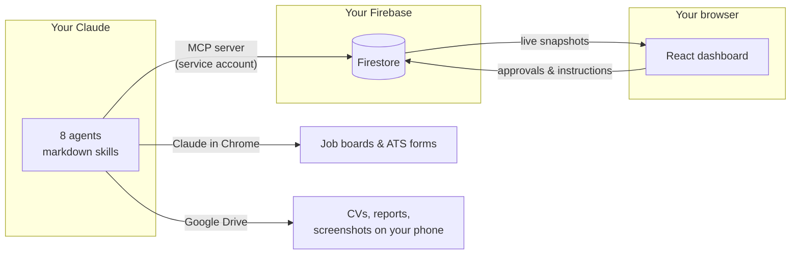
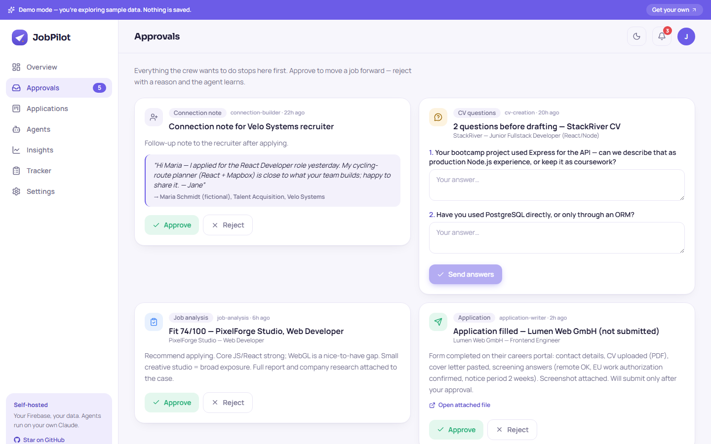

<div align="center">


# JobPilot

**A crew of AI agents that runs your job search while you sleep.**

Seven Claude agents hunt roles, score fit, draft tailored CVs, and fill applications, 
then stop and wait for **your** approval. Self-hosted on **your** Firebase and **your**
Claude. Your data never leaves your project.

[Live demo](https://7js-jobpilot.netlify.app) · [Setup guide](docs/SETUP.md) ·
[Deploy guide](docs/DEPLOY.md) · [The agents](docs/AGENTS.md) ·
[Architecture](docs/ARCHITECTURE.md) · [FAQ](docs/FAQ.md)


</div>

---

## What is this?

Job searching is a full-time job: scanning boards daily, tailoring a CV per role,
writing cover letters, tracking follow-ups. JobPilot turns that into a **pipeline run
by agents with you as the approver**. The agents do the hours; you make the decisions.
Nothing irreversible (submitting an application, sending a connection note) ever
happens without your explicit tap in the dashboard.

## The crew

| Agent | Cadence | Job |
|---|---|---|
| 🧭 **Setup** | once | Interviews you → generates your profile, market playbook, and a **CV design unique to you** |
| 🔍 **Job Search** | hourly | Finds fresh roles on your platforms, filters against your real profile |
| 📊 **Job Analysis** | hourly | Scores fit 0–100, researches the company, writes a PDF report |
| 📄 **CV Creation** | hourly | Drafts a tailored one-page CV, asks you questions instead of inventing facts |
| ✉️ **Application Writer** | hourly | Fills the whole form, screenshots it, **stops before Submit** |
| 🤝 **Connection Builder** | 2-hourly | Grows your LinkedIn network within strict limits; notes always approval-gated |
| 🎓 **Career Advisor** | daily | Mines market data for the skill gaps actually costing you matches |
| 🧠 **Manager** | 8 AM + 8 PM | Health checks, quality review, coaches the other agents |

## How it fits together



The repo is a monorepo:

```
app/         the dashboard (React 19 + Vite + Tailwind 4 + Firebase), has a zero-config demo mode
agents/      the 8 Claude agents: SKILL.md + knowledge + shared _system contracts
mcp-server/  a tiny MCP server that bridges your Claude ↔ your Firestore
landing/     the marketing site you're probably coming from
docs/        setup guide, architecture, per-agent reference
```

## Quickstart

```bash
git clone https://github.com/Mo7j/JobPilot.git
cd JobPilot
npm install
npm run dev:app     # → http://localhost:5173 in demo mode (sample data, no Firebase needed)
```

That's the demo. To run it for real (your own Firebase, your own Claude, the crew on
a schedule) follow **[docs/SETUP.md](docs/SETUP.md)**. It's eleven steps, each with a
"you know it worked when…" checkpoint, and takes about an evening.

## Design principles

1. **Approval-gated by design.** Agents prepare; the owner presses the button.
   `APPROVAL_NEXT_STATUS` in the app and the `approvalQueue` contract in the agents
   are two halves of the same gate.
2. **Honesty is enforced, not hoped for.** Your skills live in three tiers (strong /
   basic / never-claim). The never-claim tier can't appear on a CV or in an answer;
   any agent that's unsure has to ask you first.
3. **Your data is yours.** No JobPilot server, no telemetry. The app and agents talk
   only to the Firebase project *you* create. See [SECURITY.md](SECURITY.md).
4. **Unique per user.** The setup agent generates your profile, your market playbook,
   and one of 1,000+ CV designs. No two users ship the same resume template.
5. **It learns.** Every reject-with-reason teaches an agent. The manager coaches the
   crew nightly from your actual decisions.

## Screenshots

| Pipeline | Approvals | Agents |
|---|---|---|
|  |  |  |

## Status & contributing

Actively maintained. Issues and PRs welcome, see [CONTRIBUTING.md](CONTRIBUTING.md)
(short version: `npm run audit:secrets` must pass, demo mode must still work).

## Credits

Built by [Mohammed Hijazi](https://github.com/Mo7j). It started as my own
job-search automation and got rebuilt for everyone. Powered by
[Claude](https://claude.com). Mascot illustrations are AI-generated for this project.

MIT, see [LICENSE](LICENSE).
