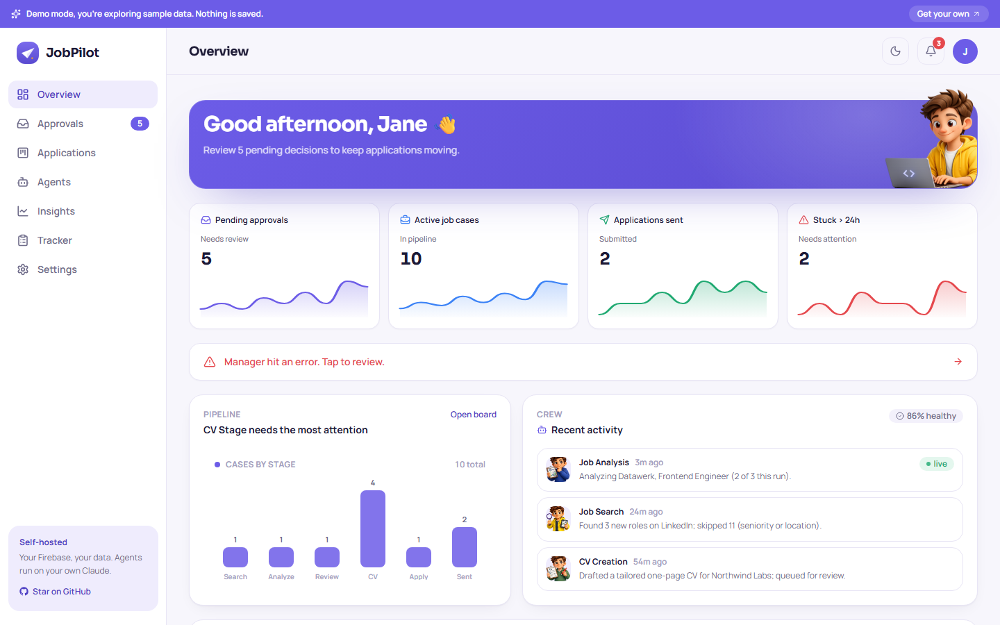
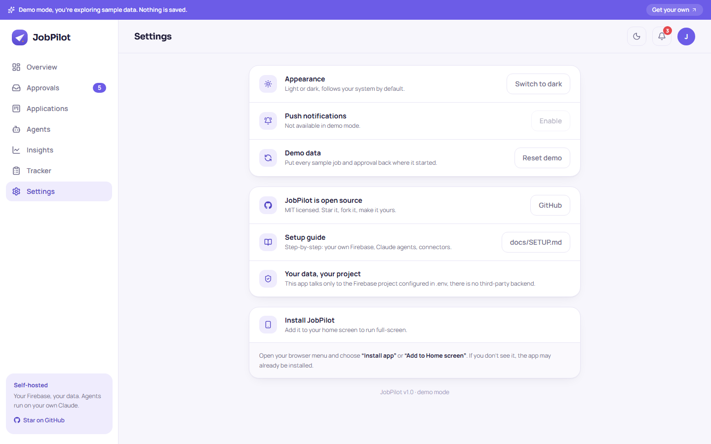
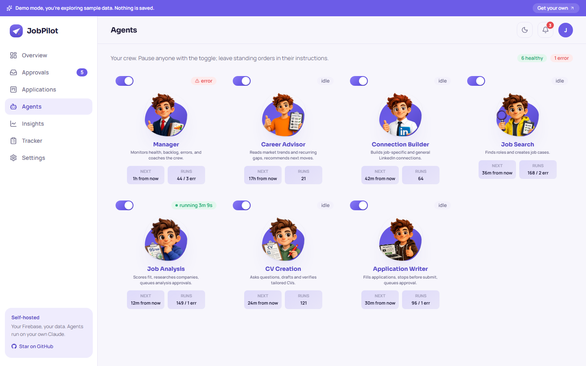
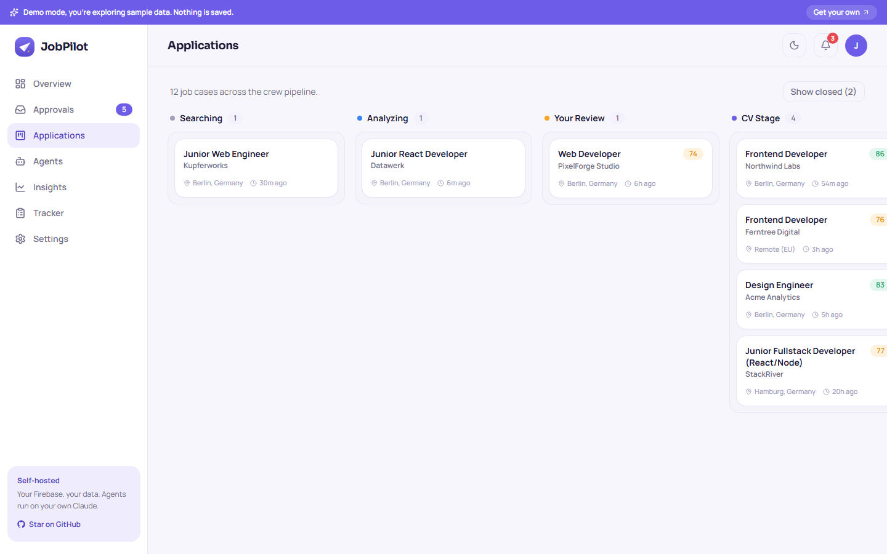

# Setting up JobPilot

Eleven steps, roughly one evening. Every step ends with a **✓ checkpoint**. If the
checkpoint fails, fix it before moving on and the rest will follow cleanly.

**You will need:** a Google account (for Firebase, free), a Claude subscription
(Claude Desktop and/or Claude Code), Node.js 20+, and git.

> **Why "create your own Firebase"?** JobPilot has no server of its own, and that's
> the point. Your profile, applications, and documents live in a database project that
> *you* create and own. Nobody else (including the people who wrote this) can see
> your job search.

---

## 1 · Clone and install

```bash
git clone https://github.com/Mo7j/JobPilot.git
cd JobPilot
npm install
```

**✓ You know it worked when:** `npm run dev:app` opens the dashboard at
`http://localhost:5173` in **demo mode** (purple "Demo mode" banner, sample data).
This is the app working end-to-end with zero configuration. Everything after this
step replaces the sample data with your real system.



## 2 · Create your Firebase project

1. Go to [console.firebase.google.com](https://console.firebase.google.com) → **Add project**.
2. Name it anything (e.g. `my-jobpilot`). Disable Google Analytics (not needed).

**✓** The project dashboard opens.

## 3 · Enable Firestore and Authentication

1. **Build → Firestore Database → Create database** → production mode → pick a region
   near you.
2. **Build → Authentication → Get started → Email/Password** → Enable → Save.
3. Still in Authentication → **Users → Add user**: your email + a strong password.
   This is the only account that will ever access your JobPilot.

**✓** Firestore shows an empty database; Authentication shows one user (you).

## 4 · Configure the app

1. In Firebase: **Project settings (gear) → General → Your apps → Web (</>)** →
   register an app (no hosting needed) → copy the `firebaseConfig` values.
2. In the repo:

```bash
cd app
cp .env.example .env
```

3. Fill `.env` with the config values, and set `VITE_ALLOWED_EMAIL` to the email from
   step 3. (The web config values identify your project; they are **not secrets**.
   The security rules in the next step are the wall.)

**✓** `npm run dev:app` from the repo root now shows a **sign-in screen** instead of
the demo, and your email + password gets you into an empty dashboard.

## 5 · Deploy the security rules

The rules lock the entire database to your account. This is the real security
boundary, not the client.

1. Edit `app/firestore.rules`: replace `OWNER_EMAIL@example.com` with your email.
2. Deploy (one-time CLI install included):

```bash
npm install -g firebase-tools
firebase login
cd app
firebase deploy --only firestore:rules --project YOUR_PROJECT_ID
```

**✓** Firebase console → Firestore → Rules shows your email in the rule.

## 6 · Run or host the dashboard

- **Local is fine:** `npm run dev:app` whenever you want to check in.
- **Hosted (recommended, works on your phone):** import the repo into
  [Netlify](https://netlify.com) (or Vercel/Firebase Hosting). Base directory `app`,
  build command `npm run build`, publish `app/dist`, and add every `VITE_*` variable
  from your `.env` in the site's environment settings. Full click-by-click steps for
  both the app and the landing page are in **[DEPLOY.md](DEPLOY.md)**.

**✓** You can sign in from your phone.

### 6a · Phone notifications (recommended)

This is the part that makes JobPilot feel alive: the moment an agent needs your
approval, your phone buzzes. It uses Firebase Cloud Messaging (FCM) and the app's
built-in service worker, no third-party push service.



1. **Add a Web Push key.** Firebase console → **Project settings → Cloud Messaging →
   Web Push certificates → Generate key pair**. Copy the key into your `.env` (and your
   Netlify env vars) as `VITE_FIREBASE_VAPID_KEY`, then redeploy. *(Without this key the
   Settings toggle stays disabled, push is fully optional.)*
2. **Install the app on your phone.** Open your hosted URL on your phone and add it to
   the home screen:
   - **iOS (Safari):** Share → **Add to Home Screen** (the app's Settings page shows
     these steps too). On iPhone, web push **only works from the installed app**, not
     a Safari tab (iOS 16.4+).
   - **Android (Chrome):** the app offers an **Install** button (Settings → Install
     JobPilot), or use the browser menu's "Install app".
3. **Enable push.** Open the installed app → **Settings → Push notifications → Enable**,
   and allow the permission prompt. This stores your device token in `settings/user`.

**How it's used:** when an agent has something urgent (an approval waiting, an error,
a deadline) it calls the MCP `send_push` tool, which delivers an FCM message your phone
shows even when the app is closed. Tapping it opens the dashboard. Less urgent updates
just appear in the in-app bell 🔔.

**✓ You know it worked when:** right after you tap Enable the button reads
**"Enabled ✓"**. To prove the whole path end-to-end, once the MCP server is connected
(step 7) ask your Claude: *"Use the jobpilot MCP `send_push` tool to send me a test
notification titled 'Hello'."*, your phone should get a notification within seconds.

> Push is optional. If you skip it, everything still works, you'll just rely on the
> in-app bell instead of phone alerts.

## 7 · The MCP server (your Claude ↔ your Firestore)

1. Firebase console → **Project settings → Service accounts → Generate new private
   key**. Save the JSON as `mcp-server/service-account.json`.
   ⚠ This file is the master key to your project. It's gitignored; keep it that way
   and never share it.
2. Register the server with your Claude:
   - **Claude Desktop:** Settings → Developer → Edit Config, add:
     ```json
     {
       "mcpServers": {
         "jobpilot": {
           "command": "node",
           "args": ["/absolute/path/to/JobPilot/mcp-server/server.js"]
         }
       }
     }
     ```
     then restart Claude Desktop.
   - **Claude Code:** from the repo root: `claude mcp add jobpilot -- node ./mcp-server/server.js`

**✓** Ask Claude: *"Use the jobpilot MCP to list the agents collection."* An empty
list `[]` is the correct answer right now.

## 8 · Give Claude the agent files

The agents are plain markdown in `agents/`. Claude just needs to be able to read them:

- **Claude Code:** nothing to do, run Claude from the repo and the files are there.
- **Claude Desktop:** make sure the JobPilot folder is accessible to your Claude
  environment (e.g. add it as a project folder / allowed directory), or copy
  `agents/` somewhere your Claude can read.

**✓** Ask Claude: *"Read agents/_system/SCHEMA.md and tell me what the approvalQueue
collection is for."* It should answer correctly.

## 9 · Connect the connectors

In your Claude (claude.ai settings → connectors / extensions):

| Connector | Needed for | Required? |
|---|---|---|
| **Claude in Chrome** | job-board search, form filling, LinkedIn | For the full experience (agents degrade to fetch-only without it) |
| **Google Drive** | CVs/reports/screenshots readable on your phone | Strongly recommended |
| **Gmail** | follow-up awareness | Optional |

**✓** Claude can open a webpage in your Chrome and list files in your Drive.

## 10 · Run the setup agent 🧭

The personal part. In Claude (with the repo accessible and the MCP server connected):

> *"Read agents/setup/SKILL.md and run the setup."*

It will interview you (have your current CV handy; it can parse it to skip most
questions), confirm everything back, then generate your profile, your **unique CV
design**, a market playbook for your country, your screening answers, and seed the
seven agents into Firestore.

**✓ The smoke test is built in:** at the end, a notification "Setup complete, your
crew is ready" appears in your dashboard's bell within seconds. If it appears, every
layer (Claude → MCP → Firestore → app) is verified working.



## 11 · Schedule the runs

Nothing runs until it's scheduled. Open `agents/scheduled/README.md` and follow it:
replace `<AGENTS_DIR>` in the wrappers with your path, then create the schedules
(Claude scheduled tasks, or cron/Task Scheduler with Claude Code).

| Schedule | Agents |
|---|---|
| Hourly (staggered) | job-search, job-analysis, cv-creation, application-writer |
| Every 2 hours | connection-builder |
| Daily 08:00 | career-advisor, manager (morning) |
| Daily 20:00 | manager (evening) |

**✓ Final checkpoint:** within an hour of the first job-search run, new job cases
appear on your Applications board, and the first approval request lands in your
inbox shortly after. From here on, your job search runs itself and waits for your
taps.



---

## Troubleshooting

| Symptom | Likely cause | Fix |
|---|---|---|
| App stuck in demo mode after configuring `.env` | dev server started before `.env` existed, or a `VITE_FIREBASE_*` value missing | restart `npm run dev:app`; check all 6 Firebase values are set |
| "This account is not authorized" at sign-in | `VITE_ALLOWED_EMAIL` ≠ the Auth user | make them identical (case doesn't matter) |
| Sign-in OK but every page is empty + console shows permission errors | rules not deployed or wrong email in rules | redo step 5 |
| Claude says the jobpilot tools don't exist | MCP server not registered / Claude not restarted | redo step 7; restart Claude Desktop |
| MCP server prints "service account key not found" | key not at `mcp-server/service-account.json` | move it there or set `SERVICE_ACCOUNT_PATH` in `mcp-server/.env` |
| Setup agent's smoke-test notification never appears | wrong Firebase project (app `.env` vs service-account project differ) | both must point at the SAME project ID |
| Agents run but never touch LinkedIn/forms | Claude in Chrome not connected | step 9; agents log the degradation in their reports |

Still stuck? Open an issue with the step number and the exact error.
